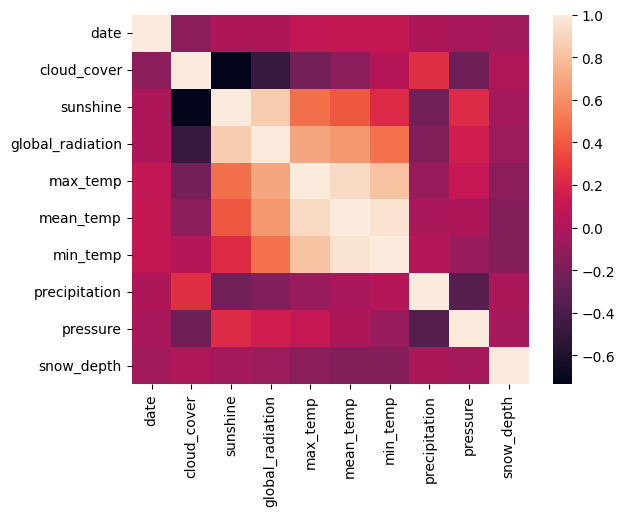
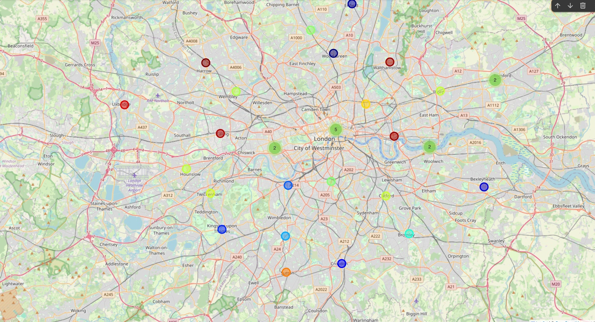
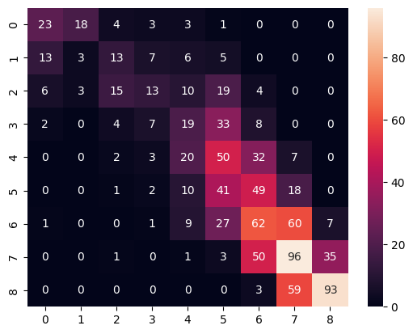
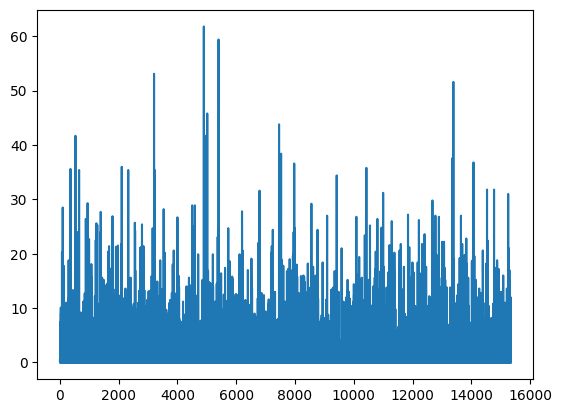

# Predicting Daily Energy Consumption from Weather Data
**SCQF Level 8 Data Science Assessment (2025)**

This project explores how weather conditions affect daily electricity consumption across London boroughs and applies data science and machine learning methods to forecast demand.

## Project Overview
A fictional London energy company provided two datasets:
- **Weather data:** daily temperature, precipitation, and sunshine duration
- **Energy data:** daily electricity consumption by borough

The goal was to combine both datasets and build a predictive model that estimates daily total energy use based on weather variables.

## Key Steps
1. **Data Preparation**
   - Cleaned and merged multiple CSV datasets using pandas
   - Handled missing values and normalised units
   - Verified data integrity through summary statistics

2. **Exploratory Analysis**
   - Visualised trends using matplotlib and seaborn
   - Identified correlations between temperature, precipitation, and energy demand

3. **Model Development**
   - Implemented and trained a neural network in TensorFlow/Keras
   - Evaluated model performance using MAE, RMSE, and R² metrics

4. **Results & Evaluation**
   - The model captured temperature-related demand variation effectively
   - Final model achieved strong predictive performance on validation data

## Key Technologies
Python • pandas • numpy • matplotlib • seaborn • TensorFlow/Keras

## Learning Outcomes
- Developed practical skills in data cleaning, modelling, and evaluation
- Applied machine learning to environmental and energy data
- Strengthened coding discipline through documentation and validation

The analysis explored the relationship between weather and electricity consumption in London between 1970 and 2020. The data revealed clear patterns linking meteorological conditions to energy demand:
	•	Temperature and sunshine: strongly negatively correlated with energy use as temperatures and daylight hours increased, electricity demand decreased.
	•	Precipitation and pressure: showed weaker relationships, but still influenced day-to-day variation in consumption.
	•	Model performance: baseline linear regression and neural network models achieved good predictive accuracy, confirming that weather variables can be used effectively for energy demand forecasting.

However, the model is based on historical data and should not be used for real-world forecasting without further adjustment.
London’s population has grown by an estimated 0.5 to 1.5 million since 2020, and significant socioeconomic and demographic changes have taken place. These shifts directly affect electricity demand but are not captured in the available datasets.

If the model were applied to today’s population, forecasts would likely underestimate consumption. To use such a model responsibly, it would need to be scaled to reflect current demographics and infrastructure. Otherwise, under-forecasting could lead to grid instability or increased costs for customers.

Overall, this project demonstrates that weather-based energy forecasting is a powerful analytical tool, but it must be combined with up-to-date population and economic data to remain accurate and relevant.

## Visual Results

Here are some key visualisations from the Energy Consumption Forecasting project:

### 1. Correlation Heatmap
Shows relationships between weather variables such as temperature, sunshine, and precipitation.

### 2. London Energy Map
A geospatial view showing borough-level variation in energy consumption across London.

### 3. Model Evaluation
The confusion matrix and regression results show model performance.

### 4. Temperature and Precipitation Trends
Observed trends over time from the weather dataset.

## Summary of Results

The analysis showed a clear link between weather and electricity consumption in London.
- **Temperature and sunshine**: negatively correlated with energy use as temperature and daylight increase, energy demand decreases.
- **Precipitation**: had a weaker but still measurable impact.
- **Model performance**: the neural network and regression models achieved strong predictive accuracy, confirming that weather variables can reliably forecast energy demand.
- **Practical outcome**: these insights could help energy providers plan for seasonal demand and promote sustainable resource management.

## Note
For assessment and data privacy reasons, the full source code and raw datasets are not published publicly. However, plots, metrics, and a high-level summary of results are shared here.
